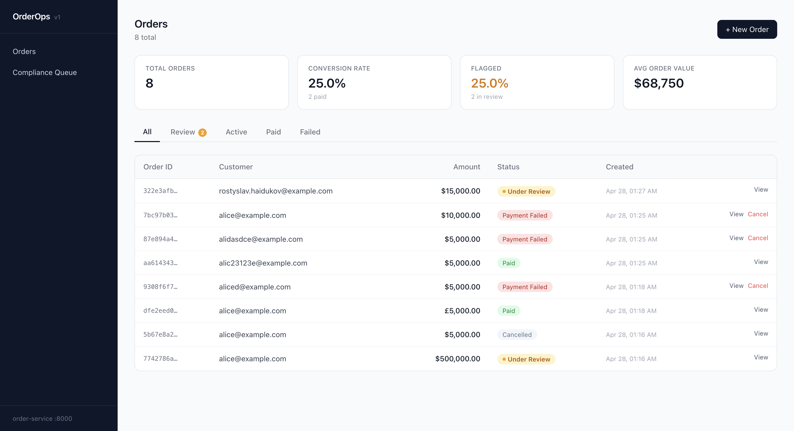
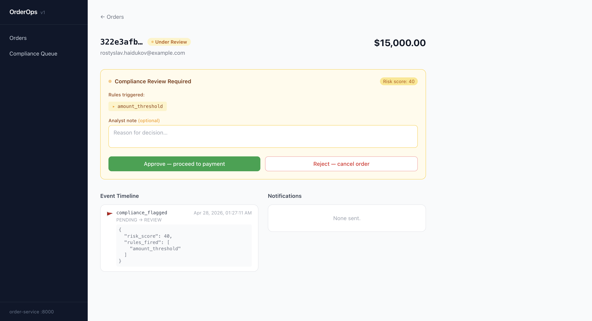

# Dashboard

> Polling-based real-time UI · Server-side API proxy · AML rule engine integration · Full Docker Compose orchestration

Operations dashboard for the order management platform. Built with **Next.js 15 + TypeScript + Tailwind CSS** — provides a real-time view of the order lifecycle, a compliance review queue, and test order creation.





## What this demonstrates

- **Polling-based real-time UI** — orders table auto-refreshes every 5 s using `setInterval` + `useCallback`; no WebSocket complexity needed for this access pattern
- **Server-side API proxy pattern** — all browser requests go through a Next.js Route Handler (`/api/*` → order-service); the backend is never exposed directly to the browser, no CORS config required
- **AML rule engine integration** — compliance-flagged orders surface in a dedicated review queue with triggered rules and risk score; analyst approve/reject wired to a protected admin endpoint
- **Full Docker Compose orchestration** — single `docker compose up` starts 8 services: dashboard, order-service API, ARQ worker, payment-provider, 2× PostgreSQL, 2× Redis
- **TypeScript end-to-end** — typed API response models in `lib/types.ts` shared across fetch wrappers and components; strict mode enabled

## Features

- **Stats bar** — live KPIs: total orders, conversion rate, flagged %, average order value
- **Orders table** — live list of all orders with status badges, auto-refreshes every 5 seconds
- **Status tabs** — filter by All / Review / Active / Paid / Failed
- **Order detail** — full event timeline, notification log, fulfill and cancel actions
- **Compliance review queue** — flagged orders surface with the triggered AML rules and risk score; analyst can approve (proceeds to payment) or reject (cancels order)
- **Create order modal** — submit test orders against all four mock card tokens

## Stack

| Layer | Technology |
|---|---|
| Framework | Next.js 15 (App Router) |
| Language | TypeScript |
| Styling | Tailwind CSS |
| Data fetching | Native fetch + 5s polling |
| API proxy | Next.js Route Handler (`/api/*` → order-service) |

## Running

### With Docker Compose (full stack)

Starts all services — order-service, payment-provider, both databases, both Redis instances, ARQ worker, and the dashboard:

```bash
docker compose up
```

Dashboard available at **http://localhost:3001**.

### Locally (dev)

Requires order-service running separately (see `../order-service`).

```bash
npm install
npm run dev        # http://localhost:3001
```

`API_URL` defaults to `http://localhost:8000` — override via environment variable if needed.

## How the API proxy works

The Next.js server proxies `/api/*` → `http://api:8000/*` (Docker) or `http://localhost:8000/*` (dev) via a catch-all Route Handler. The browser never talks to order-service directly — all requests go through the Next.js server. This keeps the backend off the public internet without any CORS configuration.

## Compliance review flow

1. Create an order that triggers an AML rule — e.g. amount > $10,000 or the same email submitting 4+ orders within an hour
2. The order lands in **Under Review** status (amber badge with pulsing dot)
3. Open the order detail page — the compliance panel shows which rules fired and the risk score
4. Approve → order proceeds to payment-provider; Reject → order is cancelled
